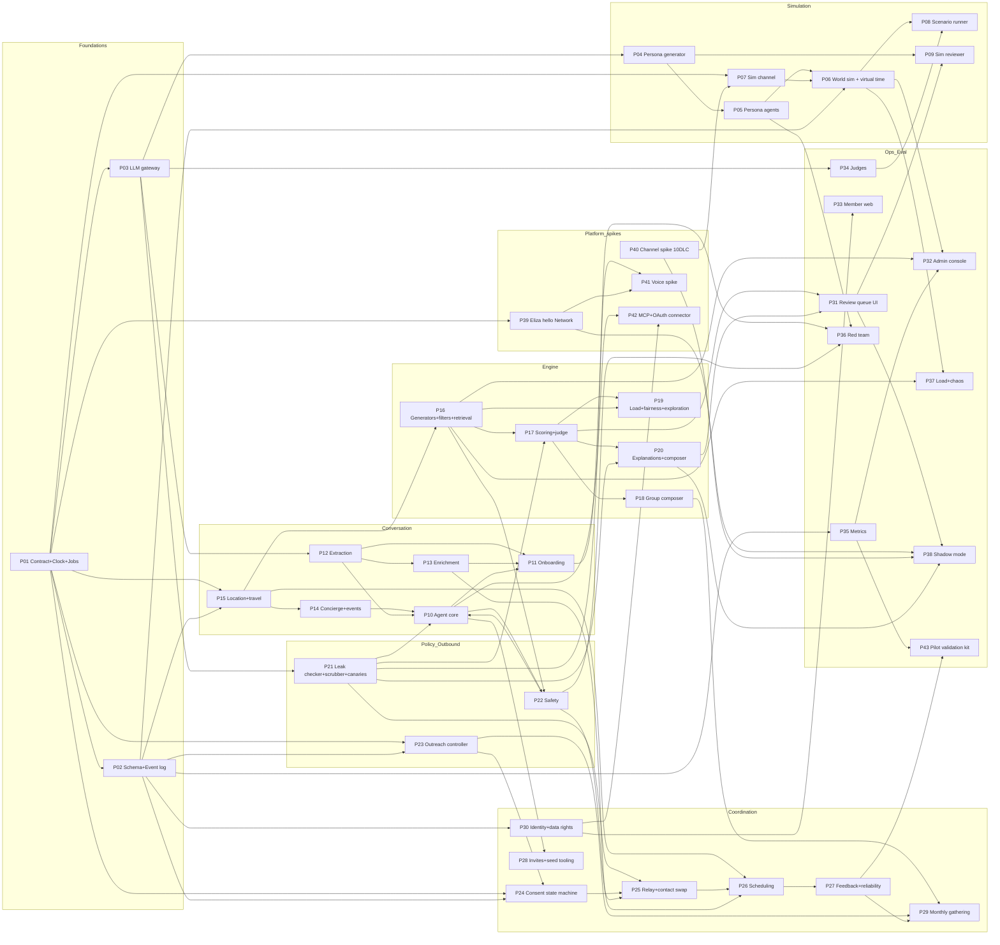

# The Network: Prototype Plan

Status: draft v0.1 (2026-10-05). Source of truth for requirements: [prd-snapshot.md](prd-snapshot.md) (PRD v0.2). Companion: [test-plan.md](test-plan.md).

This document lists every prototype needed to prove out the system before and while the MVP is built. A prototype here is a runnable, throwaway-or-promotable artifact with a falsifiable exit criterion. Each one exists to retire a specific hypothesis, requirement risk, or integration unknown from the PRD.

## 0. Conventions

| Term | Meaning |
|---|---|
| **Standalone** | Lives in this repo as a Bun workspace under `prototypes/<id>-<slug>/` (the root `package.json` already declares `prototypes/*`), depends only on `packages/core`. Runs locally against PGlite, the SimClock, and Surplus `gpt-6-luna`. Logic that proves out is promoted into the Eliza monorepo Network service package / plugin (PRD 31.1). |
| **Eliza spike** | Built inside the Eliza monorepo / Eliza Cloud staging (`eliza-cloud-api-staging`, staging Postgres, gateway-webhook). Proves platform assumptions that cannot be faked locally. |
| **Effort** | S = up to 3 engineer-days, M = 1-2 engineer-weeks, L = 3+ engineer-weeks. |
| **Priority** | **T1 Before pilot** = required to pass the 28.5 launch gates and enter M6. **T2 Before proactive matching** = required before proactive sends are switched on in a city (M7, 20.3, 32.8 precision gate). **T3 Later** = post-MVP (28.4). "Start now" marks long-lead items. |
| **Citations** | Section numbers refer to the PRD. Flows F1-F29 / L1-L10 (29.1), engine requirements ME-001..ME-012 (33.12), success criteria (28.2), launch gates (28.5), phone requirements PH-xxx (9.4), gateway GW-xxx (11.4), security SEC-xxx (22.6). |
| **LLM** | All LLM work uses `gpt-6-luna` on Surplus Intelligence through `packages/core/src/llm.ts` (`defaultLLM()`, `judgeLLM()`, `recommenderLLM()`; founder decision 2026-10-05). No automatic fallback to another provider. Cerebras is optional and legacy. A different judge model is used for audits only, with founder approval (see test-plan section 9.3). |

### 0.1 What already exists

`packages/core/src` contains `types.ts` (domain contract), `clock.ts` (`Clock`, `RealClock`, `SimClock`), `llm.ts` (OpenAI-compatible clients for Surplus, OpenAI and Cerebras with a 60 s timeout, bounded retries on 429/5xx, provider validation, and `parseJson`), and live smoke tests that run only with `LIVE_TESTS=1`. P01 and P03 extend these files; they do not replace them.

### 0.2 Age is a policy dimension (founder direction, 2026-10-05)

The PRD currently says the Network is adults only (17.4, 27, 28.3). Founder direction: the Network is **not** 18+ by definition; only the romance category, and any other adult-only feature, is inherently adult-gated. **Whether under-18 members are ever allowed is an open decision** and this plan does not make it. Instead, every prototype treats age as configuration:

| Element | Definition |
|---|---|
| `agePolicy` | Deployment-level setting. `ADULT_ONLY` (current PRD default; under-18 members cannot activate) or `MINORS_ALLOWED` (hypothetical; only if the founders decide so). Tests run under both configurations so the decision can be made later without rework. |
| Age status per member | `unknown`, `self_attested_18plus`, `verified_18plus`, `under_18`. What counts as "verified" in the MVP (attestation plus vouch, or ID verification such as Stripe Identity or Persona) is also open; tests are written against the abstract status. |
| Category age gates | Each category and feature declares `minAgeStatus`. Romance and any adult-only feature require `verified_18plus` and are unreachable otherwise, on every surface, in every flow (matching, onboarding opt-in, concierge results, explanations, connector responses). |
| Surface profiles | Each host surface (SMS, iMessage, web, ChatGPT, Claude, Grok, Muse, future) declares the categories and content it may expose. Third-party assistant profiles (for example ChatGPT) never expose romance or adult content, regardless of the member's own status. |
| Adult-minor separation | If `MINORS_ALLOWED` is ever chosen: no in-person configuration (intro, group, event co-attendance, help request, gathering grouping, second encounter, relay contact swap) may contain both an adult and an under-18 member. Enforced as a hard filter, not a score. |

Owners: P01 (types), P16 (hard filters), P20 (explanations), P22 (enforcement), P30 (status capture), P42 (surface profiles), P36 (adversarial tests). Test details: test-plan sections 6.6 and 7.30.

## 1. Prototype index

| ID | Name | Area | Build | Effort | Priority | Milestone |
|---|---|---|---|---|---|---|
| P01 | Shared contract, Clock, and job runner | Foundations | Standalone (`packages/core`) | M | T1, start now | M0 |
| P02 | Network schema and event log | Foundations | Standalone (PGlite + Postgres) | M | T1, start now | M0 |
| P03 | LLM gateway and model harness | Foundations | Standalone (`packages/core`) | M | T1, start now | M0 |
| P04 | Persona and synthetic population generator | Simulation | Standalone | M | T1 | M2 |
| P05 | Persona agents (LLM user simulators) | Simulation | Standalone | L | T1 | M2 |
| P06 | World simulator and virtual time | Simulation | Standalone | L | T1 | M2 |
| P07 | Simulated channel adapter | Simulation | Standalone (fixtures from P40) | S-M | T1 | M0-M2 |
| P08 | Scenario library and runner | Simulation | Standalone | M | T1 | M2-M4 |
| P09 | Simulated reviewer (oracle, LLM, human-latency model) | Simulation | Standalone | S | T1 | M3 |
| P10 | Network agent core (turn loop, action router, AI-first ladder) | Conversation | Standalone, then Eliza plugin | L | T1 | M1 |
| P11 | Onboarding conversation | Conversation | Standalone, then Eliza plugin | M | T1 | M1 |
| P12 | Extraction (strict + additive) | Conversation | Standalone | M | T1 | M1 |
| P13 | Enrichment (LinkedIn/X URL, AI-memory paste, calendar, vouch notes) | Conversation | Standalone | M | T1 | M1 |
| P14 | Concierge and event ingestion (Luma, Partiful, Eventbrite, Cerebral Valley) | World knowledge | Standalone | M | T1 | M1 |
| P15 | Location, presence, and travel-time model | World knowledge | Standalone | S-M | T1 | M3 |
| P16 | Opportunity generators, hard filters, and retrieval | Engine | Standalone | L | T1 | M3 |
| P17 | Scoring and LLM judge | Engine | Standalone | L | T1 | M3 |
| P18 | Group composer | Engine | Standalone | M | T1 | M3 |
| P19 | Load balancing, fairness, and exploration | Engine | Standalone | M | T1 | M3 |
| P20 | Explanation builder and message composer | Engine / outbound | Standalone | M | T1 | M3 |
| P21 | Privacy leak checker, PII scrubber, and canaries | Policy | Standalone | L | T1 | M1-M3 |
| P22 | Safety subsystem (classifier, block, report, holds, high-risk, age policy) | Policy | Standalone | M | T1 | M1-M3 |
| P23 | Outreach controller (budgets, quiet hours, two-unanswered) | Outbound | Standalone | M | T1 | M3 |
| P24 | Consent workflow and opportunity state machine | Coordination | Standalone | M | T1 | M4 |
| P25 | Relay and contact swap | Coordination | Standalone | M | T1 | M4 |
| P26 | Scheduling and commitment (slots, venues, reminders, flakes) | Coordination | Standalone | L | T1 | M4 |
| P27 | Feedback, reliability, and edge learning | Coordination | Standalone | M | T1 | M4 |
| P28 | Invitations, vouch, and consented seed-list tooling | Growth | Standalone + admin | M | T1 | M1 |
| P29 | Monthly all-member gathering program | Growth | Standalone | S | T1 | M4 |
| P30 | Identity, channel linking, and data rights (export/delete) | Identity | Standalone, then Eliza | M | T1 | M1 |
| P31 | Review queue UI and reviewer rubric | Operations | Standalone React, then eliza.app admin | M | T1 | M3 |
| P32 | Admin console (member 360, perspective timeline, graph explorer, pipeline, run inspector) | Operations | Standalone React, then eliza.app admin | L | T1 | M2 (viewer), M5 |
| P33 | Member web pages | Member surface | Eliza (eliza.app) | M | T1 | M1 |
| P34 | Judges and rubrics | Evaluation | Standalone | M | T1 | M2 |
| P35 | Metrics and analytics pipeline | Evaluation | Standalone (DuckDB), then Eliza | M | T1 | M2 (min), M5 |
| P36 | Red-team and adversarial personas | Evaluation | Standalone | M | T1 (core pack) | M3-M4 |
| P37 | Load and chaos | Evaluation | Standalone + staging | M | T1 | M4-M5 |
| P38 | Shadow mode | Evaluation | Eliza (production, sends disabled) | S | T2 | M6 |
| P39 | Eliza shared-agent "hello Network" spike | Platform spike | Eliza spike | S-M | T1, start now | M0 |
| P40 | Messaging channel spike (Blooio, Twilio, STOP/HELP, 10DLC) | Platform spike | Eliza spike | M (long calendar) | T1, start now | M0 |
| P41 | Voice onboarding spike | Platform spike | Eliza spike | S | T1 (may slip to T2) | M1 |
| P42 | Assistant connector (MCP + OAuth) for Claude, ChatGPT, Grok, Muse | Platform spike | Eliza spike | L | T3 (OAuth feasibility S in T2) | Post-MVP |
| P43 | Pilot validation kit (experiments, "worth a text?", interviews) | Validation | Standalone + admin | S | T2 | M6-M7 |

Coverage check against the requested minimum: shared contract + Clock (P01), model harness (P03), persona generator (P04), persona agents (P05), world simulator (P06), simulated channel (P07), matching engine v1 (P16-P20), leak checker + canaries (P21), outreach controller (P23), consent workflow (P24), relay (P25), scheduling (P26), feedback/reliability (P27), extraction and enrichment (P12, P13), onboarding (P11), concierge + events (P14), review queue (P31), admin console (P32), member web (P33), Eliza spike (P39), messaging spike (P40), connector (P42), seed invites (P28), judges (P34), metrics (P35), load/chaos (P37), red team (P36), shadow mode (P38). Added because the PRD needs them and nothing above covers them: P02 schema/event log, P08 scenario runner, P09 simulated reviewer, P10 agent core, P15 location/travel, P22 safety, P29 monthly gathering, P30 identity/data rights, P41 voice, P43 pilot validation kit.

## 2. Prototype specifications

### Foundations

#### P01. Shared contract, Clock, and job runner

| Field | Detail |
|---|---|
| Proves | 31.1 "Everything takes time from a Clock"; 32.18 jobs with due_at and leases; 32.10 "allowed transitions defined as a table in code"; 13.4 event sourcing; ME-004 (reproducibility), ME-006 (one ID space), ME-010 (exclusive, idempotent ticks); 28.5 gate "no state-machine invariant violations"; 34.2 "Jobs and Clock" row. |
| What | Extend `packages/core`: (1) close contract gaps (below); (2) `Clock` plus local-time helpers (member time zone, DST-safe week boundaries for budget resets); (3) `JobQueue` interface (type, payload, due_at, attempts, lease, idempotency key, status) with in-memory and Postgres implementations; `SimClock.drainDue()` that runs due jobs in (due_at, key) order; (4) event-log types (actor type: member, agent, engine, reviewer, admin, sim); (5) opportunity and participation transition tables (from, to, trigger, actor, timer); (6) branded `MemberId`/`OpportunityId` UUID types; (7) seeded RNG; (8) lint rule banning `Date.now`, `new Date()` without an argument, `setTimeout` for business timers, and `Math.random` in Network code. |
| Contract gaps found in `types.ts` | `Member` has no time zone, account status (invited, onboarding, active, paused, restricted, removed), channel identities, per-category interruption thresholds, or budget state. `Facet` lacks status (proposed/confirmed/rejected), source_ref, and revision (needed by the ME-008 cache). `Intent` lacks last_confirmed_at (60-day reconfirm, F9). `Edge` lacks privacy_scope, context_tags, evidence (B.2). `Category` lacks cause/fun/play (6.1). Missing types: Opportunity (B.1), Participation (invited..replaced), Thread, ThreadMessage, ContactShare, ConsentRecord, Feedback, ReliabilityEvidence, WorldEvent, ReviewItem, OutboundMessage, Job, AuditEvent, SafetyCase, Invitation. `Proposal` lacks safety_class, expiry, message briefs, model versions, run id and seed (ME-004). `Member.age` is a bare number; replace with an age status (unknown, self_attested_18plus, verified_18plus, under_18), add `agePolicy`, per-category `minAgeStatus`, and a `SurfaceProfile` type (section 0.2). |
| Inputs / outputs | Inputs: none. Outputs: typed contract and runtime used by every other prototype. |
| Build | TypeScript on Bun, `bun test`, fast-check for property tests, a Biome/ESLint custom rule for the clock ban. Standalone in `packages/core`. |
| Dependencies | None. |
| Exit criteria | Every (state, trigger) pair in the transition tables has a test; property test of 10k random event sequences accepts 0 illegal transitions; 10k jobs across 8 concurrent workers run exactly once; SimClock drain order verified with tie-breaking; the lint rule runs in CI with 0 violations; the same seed produces a byte-identical event log. |
| Effort / priority | M / T1, start now (M0). |

#### P02. Network schema and event log

| Field | Detail |
|---|---|
| Proves | 32.4, 32.19, 13.4, 31.4; 34.1 database row (no duplicate active opportunities, advisory locks, job leasing, deletion propagation); ME-007 (profile syncs never erase engine-learned state); ME-010; SEC-005 (deletion reaches embeddings and projections). |
| What | Drizzle schema for `network.*`: members, channel_identities, roles, facets (pgvector), intents, presence, preferences, edges, invitations, opportunities, participations, review_items, outbound_messages, threads, thread_messages, contact_shares, feedback, reliability_evidence, blocks, safety_cases, world_events, matching_runs, jobs, events (append-only). Projection rebuild from the event log. Engine-learned state in separate tables from profile tables. |
| Inputs / outputs | Inputs: P01 types. Outputs: migrations runnable on PGlite (local and sim) and Postgres 18 with pgvector (staging), plus projection-rebuild tooling. |
| Build | Drizzle + PGlite + Docker Postgres 18. Standalone first; migrations later move into the Eliza monorepo `network` schema with separate roles (31.4). |
| Dependencies | P01. |
| Exit criteria | Migrations identical on PGlite and PG18; a unique partial index rejects a second active opportunity for the same participant set and objective hash; advisory-lock exclusivity test; member deletion leaves 0 PII rows outside the retention table and 0 embeddings (row scan); projection rebuilt from events equals live tables for a 300-persona, 30-day simulated snapshot; a profile sync leaves engine tables unchanged. |
| Effort / priority | M / T1, start now (M0). |

#### P03. LLM gateway and model harness

| Field | Detail |
|---|---|
| Proves | 22.1 vendor-neutral model gateway; 22.4 structured, schema-validated output before it becomes state; 21.4 / 32.20 model versions attached to decisions; ME-004; 36.4 cost tracking and alerts; 34.5 "judges use a different model"; SEC-001 (scrub before third-party models). |
| What | Wraps the core clients (`defaultLLM()`, `judgeLLM()`, `recommenderLLM()`): role routing (`AGENT_MODEL`, `PERSONA_MODEL`, `JUDGE_MODEL`, `EXTRACT_MODEL`, `LEAKCHECK_MODEL`) via env; zod schema validation with one repair retry; token and cost metering (input, output, reasoning, cached); a token-bucket limiter per model for RPM and TPM; record/replay cassettes keyed by hash(model, messages, params) for deterministic CI; a deterministic fake LLM for unit tests; versioned prompt registry; latency and fault injection hooks (used by P37); scrub hook before any call; the API key never logged. |
| Notes | `gpt-6-luna` is a reasoning model, so hidden reasoning tokens consume the completion budget; measure the overhead per prompt type and size budgets from data. Surplus rate limits bound simulation throughput and have not been measured yet (test-plan section 15). |
| Inputs / outputs | Inputs: prompts, schemas, role. Outputs: validated objects, usage records, cassettes. |
| Build | TypeScript, zod. Standalone in `packages/core`. |
| Dependencies | P01. |
| Exit criteria | At least 99% schema-valid output after at most one repair over 500 calls per prompt type; a recorded scenario replays with a 100% cassette hit rate; the cost meter is within 2% of provider usage fields; sustained 90% of TPM without 429 storms; p50/p95 latency recorded per role; a model swap needs only an env change. |
| Effort / priority | M / T1, start now (M0). |

### Simulation

#### P04. Persona and synthetic population generator

| Field | Detail |
|---|---|
| Proves | 34.3 persona generator with hidden ground truth; provides the oracle for 28.2 precision and recall in simulation; 24 "clique replication" and "hidden internal caste" (needs diverse populations to detect); 36.5 density (how many latent opportunities exist at 40, 75, 150, 300 members). |
| What | Two stages. (1) A seeded deterministic sampler draws structured hidden truth: city, H3 home and work areas, weekly routine, true age and age honesty, true interests and skills (controlled vocabulary), hidden desires, intents, per-category yes/no tendencies, boundaries, romance opt-in and preferences, social energy, response latency distribution, ignore probability, flakiness, honesty, verbosity, writing style, archetype, and relationships to other personas (friends, coworkers, exes, invite lineage). (2) The LLM writes narrative only: backstory, voice sample, and "what I would tell the agent" versus hidden truth. Also outputs a **ground-truth oracle**: pairwise and group latent-opportunity sets computed deterministically from structured fields (never by an LLM), and canary facts per persona (test-plan section 10). |
| Inputs / outputs | Inputs: population config (size, city split, archetype mix, seed). Outputs: versioned persona cards (JSON), relationship graph, oracle tables, canary registry. |
| Build | TypeScript + P03. Standalone `prototypes/p04-persona-gen`. Oracle tables are stored in a separate `sim_truth` schema that Network code cannot read (test-plan INV-SIM-01). |
| Dependencies | P01, P03. |
| Exit criteria | 300 personas in under 10 minutes and under $3; sampled distributions match config within 5 points; no two narratives with cosine similarity above 0.9; human spot check of 30 cards rates at least 90% "plausible person"; at least 80% of personas have a non-empty latent-opportunity set at 300 members; a density curve (latent opportunities per persona at 40/75/150/300 members per city) is reported; every persona carries its assigned canary types. |
| Effort / priority | M / T1 (M2). |

#### P05. Persona agents (LLM user simulators)

| Field | Detail |
|---|---|
| Proves | 34.3 persona agents "driven by hidden ground truth plus calibrated randomness"; makes 28.2 metrics measurable before the pilot; 34.5 "the system is not graded by itself" (see the same-model limitation, test-plan 9.3). |
| What | Each persona has (a) a deterministic, seeded **policy layer** that decides reply or ignore, latency, accept/decline/counter-propose, flake, honesty distortion, when to disclose a canary, and STOP/block/report; and (b) an **LLM voice layer** that writes the text in the persona's style with memory (rolling summary plus recent turns). A private self-report channel answers "was that worth a text?" from hidden truth. Three modes: scripted (templates, no LLM), hybrid (LLM for focal personas only), full LLM. |
| Inputs / outputs | Inputs: persona card, inbound messages, virtual time. Outputs: outbound persona messages with virtual timestamps, decisions, self-reports, feedback. |
| Build | TypeScript + P03. Standalone. Persona model: `gpt-6-luna` via `defaultLLM()` (no separate persona model). |
| Dependencies | P03, P04. |
| Exit criteria | On 500 probe invitations with known hidden fit, accept rate is monotone in fit and within 5 points of the configured tendency curve; sampled latencies pass a KS test (p > 0.05) against the configured distribution; persona-realism judge (J7) at least 85%; 0 ground-truth leaks outside designed disclosures in 1,000 turns of agent probing; cost per persona turn within budget (test-plan 15). |
| Effort / priority | L / T1 (M2). |

#### P06. World simulator and virtual time

| Field | Detail |
|---|---|
| Proves | 34.3 virtual time (real-time, accelerated, discrete-event), outcome model, world events, determinism and replay; M2 exit "100 personas, 14 simulated days"; M4 exit "300 personas, 60 simulated days"; 28.5 gate "30 simulated days at accelerated time"; ME-004. |
| What | A discrete-event core with one priority queue merging persona actions (from routines and latency samples), Network jobs (due_at from P01), world events (synthetic calendar plus optional ingested events), and shocks (rainy weekend, holiday, a popular member goes quiet, invite burst). Modes: **real time** (RealClock, demos and staging smoke), **accelerated** (SimClock advanced at a pacing ratio such as one simulated day per wall minute, with lockstep backpressure when the LLM queue saturates), **discrete-event** (jump to the next due item; LLM calls take zero virtual time or a sampled virtual latency). **Outcome model**: show-up = f(flakiness, distance, lead time, shock), meeting quality = f(hidden compatibility) + noise, then persona feedback in its own words. **Run storage**: seed, config, model versions, all messages, decisions, engine logs, written as JSONL plus a PGlite dump under `runs/` (gitignored), later R2. Replay and diff tooling. |
| Inputs / outputs | Inputs: population, scenario scripts (P08), engine version, mode, seed. Outputs: run directory, metrics (P35), judge and canary results. |
| Build | TypeScript on Bun. Standalone `prototypes/p06-world`. Later runs as the `network-matcher` or a dedicated sim worker on Railway against staging (31.2). |
| Dependencies | P01, P02, P03, P05, P07. |
| Exit criteria | 100 x 14 completes; 300 x 30 discrete-event completes within the wall-clock budget in test-plan 15 (target at most 10 hours on Developer tier in lean mode); a replay with cassettes reproduces an identical event-log hash; 0 events processed out of virtual-time order; with scripted personas and a fixed seed, accelerated and discrete-event modes give identical outcomes. |
| Effort / priority | L / T1 (M2). |

#### P07. Simulated channel adapter

| Field | Detail |
|---|---|
| Proves | 34.3 "the same webhook ingress and outbound send paths"; 32.2 idempotency, delivery receipts, iMessage-to-SMS fallback, STOP/HELP/START; 34.2 channel gateway row. |
| What | Fake Blooio and Twilio providers that emit webhook payloads byte-compatible with recorded real fixtures (from P40), accept outbound send calls, produce delivery and read receipts, apply carrier STOP semantics (no delivery until START), and inject faults (duplicate webhooks, delay, drop, reordering, provider 5xx, iMessage undeliverable). Implements the same adapter interface as production. |
| Build | TypeScript. Standalone; fixtures checked in under `prototypes/p07-sim-channel/fixtures`. |
| Dependencies | P01; P40 for real fixtures (synthetic fixtures until then). |
| Exit criteria | Contract tests pass against at least 20 recorded payload types; 3 duplicate webhooks produce 1 agent turn; the same idempotency key sent twice produces 1 delivery; 0 deliveries after STOP across 10k random sequences; fallback fires within the configured window. |
| Effort / priority | S-M / T1 (skeleton M0, complete M2). |

#### P08. Scenario library and runner

| Field | Detail |
|---|---|
| Proves | 34.3 scenario scripts; 28.5 "all MVP flows pass end-to-end"; 34.1 agent scenario and multi-member scenario layers. |
| What | A TypeScript DSL: given a world state, scripted or LLM personas, and timed stimuli, assert over the event log, messages, and DB state within virtual-time bounds. One scenario per flow variant in test-plan section 7 (about 200). Runs isolated or on top of a background world. Outputs JSONL reports, pass/fail, judge scores. Tags: `fast` (cassette replay, PR CI), `live`, `nightly`. |
| Build | TypeScript on top of P06. Standalone. |
| Dependencies | P06, P34. |
| Exit criteria | At least one scenario per variant in test-plan section 7; the fast subset finishes in under 10 minutes on cassettes; the live-subset flake rate is under 2% across 20 reruns. |
| Effort / priority | M / T1 (M2-M4, grows with each milestone). |

#### P09. Simulated reviewer

| Field | Detail |
|---|---|
| Proves | Lets "every proactive proposal is reviewed" (1.2.2, 32.8, 33.9) run in simulation without blocking on humans; measures the re-roll path, SLA expiry, and the 28.2 ops criterion (reviewer-minutes per sent proposal). |
| What | Three reviewer bots that use the same scrubbed review card humans see: (a) **oracle** reviewer (approve if and only if the oracle says the latent opportunity is real and policy is clean), an upper bound; (b) **LLM reviewer** applying the written rubric, which tests whether the rubric is clear enough; (c) **human-latency model** (coverage hours per city, decision-delay distribution, error rate) to exercise SLA expiry. A human mode routes items to the P31 UI for calibration sessions. |
| Build | TypeScript + P03. Standalone. |
| Dependencies | P04, P31 schema, P34. |
| Exit criteria | LLM reviewer vs oracle Cohen's kappa at least 0.6 on 300 proposals; SLA-expiry path exercised in every nightly run; bot labels stored in the same schema as human labels. |
| Effort / priority | S / T1 (M3). |

### Member conversation

#### P10. Network agent core (turn loop, action router, AI-first ladder)

| Field | Detail |
|---|---|
| Proves | 31.3 inbound loop; 32.3 providers, actions, and evaluators; 30.4 "the LLM writes, it does not decide"; 12.2 escalation ladder and F8 routing; 20.2 / App C AI-first hypothesis; 12.4 agent voice; SEC-006 prompt injection; PH-005 shared state across channels. |
| What | A framework-agnostic Network plugin core: providers (MEMBER_CONTEXT, ACTIVE_ITEMS, CITY_CONTEXT), the 12 actions (UPDATE_PROFILE, MANAGE_INTENT, ASK_NETWORK, RESPOND_TO_OPPORTUNITY, RELAY_MESSAGE, SHARE_CONTACT, SCHEDULE, SET_STATE, INVITE_PERSON, BLOCK_OR_REPORT, GIVE_FEEDBACK, CONCIERGE_SEARCH), deterministic handlers that call the Network service API, reply phrasing from a brief, and deterministic style rules. A surface-profile and category age-gate filter applies to every reply and every item list, so romance and adult-only content never reach a surface or member that is not allowed to see it. An F8 classifier routes requests to information, recommendation, standing intent, or human opportunity. An adapter lets the same core run standalone in the simulator and inside Eliza (P39). |
| Build | TypeScript + P03. Standalone `prototypes/p10-agent-core`, promoted to the Eliza Network plugin. |
| Dependencies | P01-P03, P12, P14, P21, P22. |
| Exit criteria | Action selection at least 95% on a 300-utterance labeled set (terse, sarcastic, non-native English, voice transcripts); F8 route accuracy at least 90% with human-opportunity over-escalation at most 10%; style rules pass at least 98%; 0 tool calls caused by injected instructions over 100 injection probes; p95 turn latency under 6 s on `gpt-6-luna`. |
| Effort / priority | L / T1 (M1). |

#### P11. Onboarding conversation

| Field | Detail |
|---|---|
| Proves | 9.2, 9.3, F4, PH-001, 8.2 first value, 20.2 phone-onboarding hypothesis, the "under 8 minutes, stop at any point" target, and the interruption-calibration step. |
| What | A conversational form (plugin-form style slots with stash and resume) that opens with guess-and-confirm from vouch notes and connected sources, then covers consent, one or two intents, gifts, place and time, formats and boundaries, explicit-only romance opt-in, 2-3 hypothetical opportunities that set per-category thresholds (romance opt-in is offered only to members whose age status is `verified_18plus`; otherwise the agent explains verification is required), a read-back summary, and a single-player win. Resumes at most once. Question-set variants for A/B testing. |
| Build | TypeScript on P10. Standalone, then Eliza plugin. |
| Dependencies | P10, P12, P13, P14. |
| Exit criteria (simulation) | At least 85% of responsive personas complete; median of 12 or fewer exchanges and modeled member time of 8 minutes or less; gating-field accuracy against hidden truth at least 0.9; 0 false romance opt-ins; corrections honored 100%; sensitive disclosures stored agent_private 100%; at least 70% of personas who stop midway still have a usable profile (at least one intent). |
| Exit criteria (people) | In-person test with 10 people per channel (SMS, iMessage, web): comfort at least 4/5 and no step rated invasive by more than 2 of 10. |
| Effort / priority | M / T1 (M1). |

#### P12. Extraction (strict + additive)

| Field | Detail |
|---|---|
| Proves | 32.5 strict and additive passes; 31.3 extraction loop; 13.1 provenance and confidence; 32.4 merge rules (said beats inferred, contradictions trigger a question, revision bump); PH-006 (voice transcripts classified like text). |
| What | A synchronous strict pass for gating fields (city, intents, consent answers, state changes, romance opt-in, quiet hours); an asynchronous additive pass that only adds facets and never deletes; English normalization and vocabulary mapping; privacy-scope classification; a facet merge engine. |
| Build | TypeScript + P03. Standalone. Golden sets under `prototypes/p12-extraction/golden/`. |
| Dependencies | P01, P03. |
| Exit criteria | Golden set of at least 400 labeled snippets: strict precision at least 0.95 and recall at least 0.85; additive precision at least 0.85; agent_private recall at least 0.98 with sensitive-marked-shareable at most 1%; 0 deletions by the additive pass in property tests; contradictions produce a confirmation question 100% of the time. |
| Effort / priority | M / T1 (M1). |

#### P13. Enrichment (LinkedIn/X URL, AI-memory paste, calendar, vouch notes)

| Field | Detail |
|---|---|
| Proves | 32.5, F7, 9.3 source order of preference, 1.2.8 and 13.3 no shadow profiles, 36.2 respect the terms of profile sources, F1 vouch-note handling. |
| What | Paste-first (PoC 2026-10-06: LinkedIn's robots.txt and terms prohibit automated access and X shows only the bio without its paid API, so member paste is the main path, not a fallback; see `prototypes/poc-enrichment-sources/`). X bio from the og: tag only where the terms register allows it, summarized, shown as proposed facets (provenance connected_source) for member approval; AI-memory paste parser (ChatGPT, Claude, Grok, Muse exports and freeform); Google Calendar free/busy to availability_pattern facets (no event titles); vouch notes held non-matchable until acceptance and purged on decline or after 30 days. |
| Build | TypeScript + P03. Standalone with recorded fixtures; the calendar connector is proved in P39 against the existing Eliza plugin-calendar. |
| Dependencies | P03, P12. |
| Exit criteria | 50 profile fixtures and 50 memory pastes: facet precision at least 0.85; 0 facets confirmed without member approval; 0 member or stub records created for third parties named in pastes; vouch notes purged at 30 days on the SimClock; fetching disabled for sources flagged no-fetch in a per-source terms register. |
| Effort / priority | M / T1 (M1). |

#### P14. Concierge and event ingestion

| Field | Detail |
|---|---|
| Proves | 32.6, F10, F13 event anchors, 1.2.7 "useful while small", 22.5 "never invent real-time facts", 28.2 first meaningful outcome for 60% within 14 days. |
| What | Per-city ingestion jobs for Luma, Partiful public pages, Eventbrite, Cerebral Valley, venue calendars (plus Meetup); a normalized events table (title, time, place, H3 cell, categories, price, source, freshness, embedding); cross-source dedupe; staleness rules; CONCIERGE_SEARCH ranking by interests, presence, and format; places via the maps service. Prefer public APIs and feeds; store links and minimal metadata. |
| Build | TypeScript. Standalone with recorded source fixtures; scheduled as Network jobs. |
| Dependencies | P01-P03, P15. |
| Exit criteria | At least 200 *relevant* (adult, social/professional, not civic/kids) future events per week per city from sources whose terms allow ingestion (PoC 2026-10-06: raw counts are met by Cerebral Valley, Luma calendar ICS feeds, NYC Open Data, SFPL and SF Rec & Park; Eventbrite, Meetup and Partiful forbid scraping and need partnerships; see `prototypes/poc-event-ingestion/`); dedupe precision at least 0.95 and recall at least 0.9 on labeled duplicates; 0 replies that assert hours or availability without a fresh source; J11 relevance at least 4/5 for 70% of persona queries; a written terms review per source. |
| Effort / priority | M / T1 (M1). |

#### P15. Location, presence, and travel-time model

| Field | Detail |
|---|---|
| Proves | 16.1-16.3, F26, ME-011, SEC-004 (collect precisely, never share precisely), 33.5 travel filters, 32.12 venue near the travel-time centroid. |
| What | H3 cells at several resolutions for neighborhoods; presence (home, routine, temporary with window); travel-time estimator (H3 heuristic first, maps API for finalists, cached); personal friction preferences; coarse-only rendering for other members. |
| Build | TypeScript, h3-js. Standalone. |
| Dependencies | P01, P02. |
| Exit criteria | ME-011 property tests; temporary presence includes a member in the other city only inside the window (0 out-of-window proposals); estimates within 25% of the maps API on 200 sampled pairs (PoC 2026-10-06, H3 res-8 heuristic vs OSRM: walk and bike 85-100% within 25%, car NYC 95%, car SF 60% (78% for trips over 10 minutes); transit not yet validated; see `prototypes/poc-travel-time/`); 0 outbound messages containing an exact address before opportunity-specific consent. |
| Effort / priority | S-M / T1 (M3). |

### Matching and opportunity engine v1

#### P16. Opportunity generators, hard filters, and retrieval

| Field | Detail |
|---|---|
| Proves | 33.3-33.5, 14.1-14.2; ME-001, ME-005, ME-006, ME-009, ME-010, ME-011; the 30.4 Soulmates pitfalls (completed matches block, blocks in a different ID space, expiring cooldowns, unapplied thresholds, whole-database snapshots). |
| What | Generators: intent-to-capability, complementary intents, shared-intent pooling, event anchor, warm path, help request, second encounter, newcomer welcome, network growth, expansion (group composition in P18). SQL hard filters: state and category, presence overlap in the window, blocks both ways, safety hold, budgets, per-pair and per-category cooldowns, mutual romance opt-in and preferences, category age gates (romance and adult-only require `verified_18plus` for every participant), adult-minor in-person separation when `agePolicy=MINORS_ALLOWED`, high-risk exclusions. Retrieval channels unioned and deduped: pgvector kNN top 50, tags and categories, two-hop recursive SQL over edges, event interest, availability and travel. Exposure floor. Triggers (debounced events, nightly, Wednesday pre-weekend, weekly health, monthly event). Per-city advisory lock. Matching-run logs (counts after each filter, channel contributions, components, model versions, seed). The engine reads only what members said or connected, never the simulator's hidden truth. |
| Build | TypeScript over PGlite/pgvector. Standalone `prototypes/p16-engine`, promoted to the `network-matcher` service. |
| Dependencies | P01-P03, P15; P04 for the evaluation oracle. |
| Exit criteria | 0 hard-constraint violations across all proposals in 10 seeded 300 x 60 runs (ME-001); retrieval recall at least 0.8 of oracle latent opportunities in the top-50 union; branded single-ID-space types plus tests (ME-006); a tick killed at random points leaves 0 partial proposals (ME-010); proposals reproduce byte-identically from logs with cassettes (ME-004); completed or positive pairs remain matchable (ME-005); 0 age-gate violations and (under `MINORS_ALLOWED`) 0 adult-minor in-person configurations across seeded runs of both policy configurations. |
| Effort / priority | L / T1 (M3). |

#### P17. Scoring and LLM judge

| Field | Detail |
|---|---|
| Proves | 33.6, 14.3, 14.4; ME-008, ME-009; 1.2.2 "matching quality high enough"; 28.2 opt-in at least 40%. |
| What | Component scorers (fit, mutual benefit, warm path, novelty, timing, activation cost, interruption cost, load, repetition, social risk); confidence from evidence quality; transparent weighted sum multiplied by confidence with hard floors and a separate dealbreaker flag; LLM judge (cheap pre-screen, then a strong judge for finalists) on scrubbed, scope-limited profiles with calibration anchors, per-dimension scores, and a shareable "why"; cache keyed by profile revisions with a TTL; a weight-tuning harness against the oracle and reviewer labels. |
| Build | TypeScript + P03. Standalone. |
| Dependencies | P16, P21 (scrubber), P03. |
| Exit criteria | Proposal precision against the oracle at least 0.8 at the operating threshold; judge vs oracle compatibility Spearman at least 0.6 on 500 pairs; judge test-retest agreement at least 0.85 at temperature 0; a test for every configured threshold and floor (ME-009); the cache invalidates on revision and no cached verdict is permanent (ME-008); property test that the judge never overrides reliability, safety, or load. |
| Effort / priority | L / T1 (M3). |

#### P18. Group composer

| Field | Detail |
|---|---|
| Proves | 33.7, 14.6, F12, F22 groupings, quorum alternates. |
| What | Anchor plus target size and roles; beam search maximizing average pairwise compatibility, minimum pairwise floor, role coverage, one or two existing warm ties, cluster diversity, and availability intersection; primary group plus ranked alternates; LLM judge over the top 2-3 configurations for dominance and awkward combinations. |
| Build | TypeScript. Standalone. |
| Dependencies | P16, P17. |
| Exit criteria | Within 5% of brute-force optimum on instances with n of 12 or fewer; 0 groups below the pairwise floor; at least 90% of groups have 1-2 warm ties when available; simulated group meeting quality at least the pair baseline; under 2 s per anchor at 300 members. |
| Effort / priority | M / T1 (M3). |

#### P19. Load balancing, fairness, and exploration

| Field | Detail |
|---|---|
| Proves | 33.8, 15.4, 12.3, 14.5; ME-012; 24 (helper burnout, hidden internal caste, filter bubble); 20.2 contribution-cap hypothesis; 21.2 contribution concentration. |
| What | Load penalties, per-category member quotas, exposure floors, 10-15% labeled exploration picks (tunable per member), concentration metrics (top-10% share, Gini, Lorenz), newcomer exposure, members with nothing in 14/30 days, a lint/schema check that no composite member score exists. |
| Build | TypeScript. Standalone. |
| Dependencies | P16, P17. |
| Exit criteria | In 300 x 60 runs: top-10% share of proposals at most 25% (initial target, tune); 0 quota breaches; at least 80% of newcomers with a latent opportunity get a proposal within 14 days; exploration share within 10-15% (plus or minus 2); exploration acceptance at least half of exploit acceptance; ME-012 metrics emitted every nightly run. |
| Effort / priority | M / T1 (M3). |

#### P20. Explanation builder and message composer

| Field | Detail |
|---|---|
| Proves | 17.2 explanations restricted to shareable evidence; 33.9 message briefs; 10.2 and 12.4 voice; 6.3 opportunity language; PH-003 opt-out path; ME-003. |
| What | An explanation builder whose input type admits only shareable facets (scope encoded in the type system), message briefs, LLM phrasing, deterministic style rules, then the P21 gate. Templates per flow; answers to "why did you ask me?". |
| Build | TypeScript + P03. Standalone. |
| Dependencies | P17, P21. |
| Exit criteria | 0 non-shareable facet IDs in explanation provenance (structural test); J2 explanation quality at least 4/5 on 85% of messages; opt-out path in 100% of proactive messages; style rules pass at least 98%. |
| Effort / priority | M / T1 (M3). |

### Policy, privacy, safety, outbound

#### P21. Privacy leak checker, PII scrubber, and canaries

| Field | Detail |
|---|---|
| Proves | 17.1-17.2, 32.14, ME-003, SEC-001, SEC-003; 28.5 "no privacy-canary leaks" and "every outbound message passes the leak check, enforced in code". |
| What | (1) Outbound gate: deterministic checks (canary tokens, n-gram and fuzzy match against the recipient-invisible facets of every member, phone/email/address patterns, names of non-participants) plus an LLM inference classifier for indirect leaks (including timing), returning pass/hold with a reason. (2) PII scrubber and pseudonymizer for reviewer views, logs, analytics exports, and LLM prompts that do not need PII. (3) Canary framework (test-plan section 10). (4) Code enforcement: the send API accepts only a `LeakCheckedMessage` branded type that only the gate can mint. |
| Build | TypeScript + P03. Standalone. |
| Dependencies | P01, P03. |
| Exit criteria | Detector recall at least 99.5% on a positive-control corpus of 2,000 seeded leaks (exact and paraphrased) and false-positive rate at most 2% on clean outbound; 0 canary leaks in full simulations; 0 raw phone, email, or legal name in reviewer views, logs, or exports (pattern plus canary scan); a type-level test that bypassing the gate fails to compile. |
| Effort / priority | L / T1 (deterministic gate M1 because onboarding messages need it; inference classifier M3). |

#### P22. Safety subsystem

| Field | Detail |
|---|---|
| Proves | 17.4, 17.5, F23, the F14 home-entry rule, 32.14 inbound classifier, 36.3 response targets and after-hours behavior, 3.3 anti-spam with reason and appeal, 24 (scams, romantic coercion, stalking, block abuse). |
| What | Inbound classifier (none, flag, urgent); emergency reply directing to emergency services; pair-only immediate block; report creating a safety case with preserved evidence; safety hold that stops opportunities and outreach; high-risk category filter; age-policy enforcement (category age gates, under-18 handling per the configured `agePolicy`, adult-minor in-person separation when minors are allowed, age-signal detection such as "I'm in 10th grade" that downgrades status and re-runs gates); spam rate limits with reason and appeal; relay moderation hold; safety queue with after-hours automatic hold. |
| Build | TypeScript + P03. Standalone. |
| Dependencies | P02, P10, P16. |
| Exit criteria | Urgent recall at least 0.98, flag recall at least 0.9, precision at least 0.7 on a 300-item labeled set; a block takes effect in the same tick with 0 later co-proposals; a hold stops 100% of outreach within 1 virtual minute; 0 minors activated; after-hours urgent reports get an automated reply and a hold within 60 s. Age: under `ADULT_ONLY`, 0 under-18 accounts activated; under both configurations, 0 romance or adult-only exposure to members not `verified_18plus`; under `MINORS_ALLOWED`, 0 adult-minor in-person configurations; an age signal triggers re-gating within one tick. |
| Effort / priority | M / T1 (intake M1, holds and filters M3). |

#### P23. Outreach controller

| Field | Detail |
|---|---|
| Proves | 32.9, 7.2, 12.3, F6, F20, F28; ME-002; PH-002, PH-003; 24 "benevolent spam" and "unresponsive outreach"; 28.2 mute/complaint under 5%. |
| What | Budgets by state (Normal 2/week, Open 4/week, Quiet 1/month, Receiving support-only, Paused none) with weekly reset in member local time; per-category preferences and thresholds; quiet hours with time zones and DST; priority ordering; bundling; deferral to the next allowed window; the two-unanswered rule (72 h or expiry, whichever first) moving the member to "only when I ask"; counted versus non-counted message classes; requirement that every proactive item carries an APPROVED review ID; every decision logged with a reason. |
| Build | TypeScript. Standalone. |
| Dependencies | P01, P02. |
| Exit criteria | 10k random schedules with concurrent workers: 0 budget overruns (ME-002); 0 sends in quiet hours across all time zones including DST transitions; the two-unanswered transition fires exactly as specified; non-counted messages continue after the pause; reason logged 100%. |
| Effort / priority | M / T1 (M3). |

### Coordination

#### P24. Consent workflow and opportunity state machine

| Field | Detail |
|---|---|
| Proves | 32.10, 22.3; F11, F12, F15, F29; 24 "social rejection harm"; the 28.5 invariant gate. |
| What | The transition table from P01 executed against the database; participation states; independent invitations; quorum and alternates; expiry timers (48 h default, 2-4 h same-day); duplicate-active constraint; idempotent replays; release of partial acceptances without revealing who declined. |
| Build | TypeScript. Standalone. |
| Dependencies | P01, P02, P23. |
| Exit criteria | Exhaustive (state x trigger) tests; model-based property test against a reference model with 0 divergences in 100k steps; 0 decline leaks (decliner identity is a canary in outbound to others); replaying every event twice gives the same state; graceful quorum failure in 100% of cases. |
| Effort / priority | M / T1 (M4). |

#### P25. Relay and contact swap

| Field | Detail |
|---|---|
| Proves | 17.3, 32.11, F16; 3.3 no member-to-member cold outreach. |
| What | Threads, store-and-forward with "From Maya:" prefix, group fan-out, moderation hold, bilateral contact swap, persistence, leaving a thread, faithful summaries on request, redaction on deletion. |
| Build | TypeScript. Standalone. |
| Dependencies | P21, P22, P24. |
| Exit criteria | 0 contact details delivered without both consents (property test plus leak checker); prefix on 100% of relayed messages; fan-out excludes members who left or are blocked; harassment hold recall at least 0.9; threads still usable after 60 simulated days; J12 relay fidelity at least 4.5/5. |
| Effort / priority | M / T1 (M4). |

#### P26. Scheduling and commitment

| Field | Detail |
|---|---|
| Proves | 32.12, F17, F18, 2.1, 6.2, 15.2 no-show policy; 28.2 completion at least 70% of mutually accepted. |
| What | Availability windows (stated, calendar-derived, learned with confidence); slot proposal maximizing attendance and minimizing travel and lead-time mismatch; venue suggestion near the travel-time centroid; all-party confirmation; reschedule chains; reminder plan (T-24h, T-3h, day-of check-in); running-late relay; replacement from backups; attendance capture; the forgiven-no-show policy. |
| Build | TypeScript. Standalone; calendar free/busy via the Eliza connector in P39. |
| Dependencies | P13, P15, P24, P25. |
| Exit criteria | A feasible slot is found in at least 98% of cases where brute force finds one; 0 SCHEDULED without every participant's yes; reminders within 1 virtual minute of plan; DST and cross-time-zone tests pass; simulated completion at least 70% with a flaky persona mix; replacement success at least 50% when backups exist. |
| Effort / priority | L / T1 (M4). |

#### P27. Feedback, reliability, and edge learning

| Field | Detail |
|---|---|
| Proves | 32.13, 15.1-15.2, F19, 6.4; ME-005, ME-006, ME-007; 24 "block abuse" and "fake reliability"; 28.2 second interaction at least 20%; the "worth a text?" sample behind the worthwhile-interruption metric. |
| What | Factual-then-subjective feedback; "worth a text?" sampling counted against the budget; edge updates; contextual reliability P(completion given accepted, context) with decay; rater-bias weighting and corroboration; second-encounter candidates; forgiven-no-show logic. |
| Build | TypeScript. Standalone. |
| Dependencies | P24, P26. |
| Exit criteria | Property test: declines never change reliability; first no-show forgiven, second triggers the hold until a lower-stakes completion; negative feedback touches only that pair; rater-bias weighting cuts block-abuser impact by at least 50% versus unweighted; second-encounter candidates for at least 90% of mutual positives; reliability Brier score better than the base rate in simulation. |
| Effort / priority | M / T1 (M4). |

#### P28. Invitations, vouch, and consented seed-list tooling

| Field | Detail |
|---|---|
| Proves | F1, F2, 8.1, 32.15, 36.5 seed and density plan; 28.2 "at least 30% invite, invitees activate like seed members"; 1.2.8 no shadow profiles; 24 "clique replication". |
| What | Allowances (3 per member per month); vouch-capture conversation; invite edge with strength evidence; soft-approval score and flags (weak vouch, bursts, risk keywords); invitation delivery (inviter-forwarded link by default; the agent sends at most one message, only when the inviter confirms the invitee expects it, with opt-out language and no follow-up); admin bulk seed import (CSV) with required consent-attestation fields (who knows them, how they agreed to be contacted); a cluster-spread planner so the seed spans clusters and neighborhoods; duplicate detection. |
| Build | TypeScript; admin import screen in P32. Standalone. |
| Dependencies | P02, P10, P21. |
| Exit criteria | Import rejects 100% of rows without consent attestation; the agent sends at most one invite message per invitee and 0 follow-ups; vouch notes purged at 30 days or on decline; soft-approval flag recall at least 0.9 on a synthetic set; the planner warns when any cluster exceeds 35% of a city's seed. |
| Effort / priority | M / T1 (M1). |

#### P29. Monthly all-member gathering program

| Field | Detail |
|---|---|
| Proves | F22, 32.16, 6.1 all-member gathering, 36.5 "first gathering within two weeks of opening". |
| What | Event record, priority invite list (newcomers, isolated members, pending second encounters), RSVPs, reminders, suggested groupings (P18), "anyone you want to see again?" follow-up feeding second encounters. |
| Build | TypeScript. Standalone. |
| Dependencies | P18, P23, P27. |
| Exit criteria | Priority members invited first 100%; RSVP state consistent under concurrent replies; groupings respect blocks 100%; follow-up produces second-encounter candidates in simulation. |
| Effort / priority | S / T1 (M4). |

#### P30. Identity, channel linking, and data rights

| Field | Detail |
|---|---|
| Proves | 9.1, 32.1, F3, F24, F25; SEC-005; PH-004, PH-005; 36.2 CCPA/CPRA export and deletion. |
| What | Invite token plus verified number creates the member and channel identities; age attestation and age status (behavior on under-18 depends on `agePolicy`); a verification hook for `verified_18plus` (method open); terms and messaging consent recorded; number change via the existing channel or a web magic link; adding a channel; export package by secure expiring link; deletion cascade (facets, embeddings, messages, relay-thread name redaction, open opportunities cancelled without blame, retention exceptions). |
| Build | TypeScript. Standalone, then mapped onto Eliza Cloud users and identity links (P39). |
| Dependencies | P02. |
| Exit criteria | Number change preserves member ID and history 100%; export covers 100% of tables with a member_id; deletion leaves 0 PII rows outside retention tables and 0 embeddings; deletion reaches the nightly analytics export within 24 hours. |
| Effort / priority | M / T1 (M1). |

### Operations surfaces

#### P31. Review queue UI and reviewer rubric

| Field | Detail |
|---|---|
| Proves | 32.8, 33.9, F27; 28.2 "under about 2 reviewer-minutes per sent proposal"; 28.5 "every proactive path goes through the review queue, enforced in code"; 21.4 human-composed tagging; 36.7 reviewer operations. |
| What | Keyboard-driven review card (scrubbed participants, score components, confidence, per-participant explanation, draft messages, alternates, history between these people); approve, edit, swap, re-roll with note, reject with reason code; SLA timers and expiry; double-review sampling; reviewer metrics; manual proposal creation tagged human-composed; written rubric v1 with examples. |
| Build | React (Vite) standalone against the sim API, ported into the eliza.app admin area (35.3) at M5. |
| Dependencies | P02, P17, P20, P21. |
| Exit criteria | Median time per item at most 90 s for 5 trained reviewers on 100 simulated proposals; inter-reviewer kappa at least 0.6; re-roll honors the note in at least 80% of cases; a code-path test proves the outreach controller rejects any proactive message without an APPROVED review ID; SLA expiry works. |
| Effort / priority | M / T1 (M3). |

#### P32. Admin console

| Field | Detail |
|---|---|
| Proves | 35 (all modules); 28.5 "show any member's full experience within two clicks"; M5 exit "what happened to member X this month and why in under two minutes"; 23.1 topology concerns. |
| What | Member 360; member-perspective timeline (messages interleaved with proposals considered, contact decisions and reasons, review decisions, budget state; "replay this week"); social graph explorer (Sigma.js or Cytoscape.js on precomputed layouts, time slider, isolated members, bridges, overused connectors, invite trees); opportunity pipeline (kanban and funnel); matching-run inspector (counts after each filter, channel contributions, component distributions, judge outputs, why alternatives lost, run diff); simulation lab; RBAC with scrubbed-by-default views and audited reveal. A minimal run viewer ships at M2 so the simulator is inspectable from day one. |
| Build | React (Vite) standalone reading run directories and PGlite, then ported into the eliza.app admin area with `/api/network/admin` routes. |
| Dependencies | P02, P06, P16, P35. |
| Exit criteria | Task test with 3 team members on 10 questions: median under 2 minutes, every member's experience reachable within 2 clicks of search; a 2,000-node graph renders at 30 fps or better; 100% of reveals audited. |
| Effort / priority | L / T1 (viewer M2, full M5). |

#### P33. Member web pages

| Field | Detail |
|---|---|
| Proves | 32.17, F5, F20 and F28 visibility of state changes, F24, 10.2 "boundaries one tap away", 36.8 accessibility. |
| What | Magic-link login via SMS; What the Network knows (facets by kind with source and scope; edit, delete, change scope); intents; states and preferences; connected sources; invites; history; privacy and data (export, delete). Mobile-first. |
| Build | eliza.app (Cloudflare Pages, React) in the Eliza monorepo. A clickable standalone mock is fine for the usability test before M1 ends. |
| Dependencies | P02, P30. |
| Exit criteria | Edits are honored by the next engine run (simulation test); axe automated scan with 0 critical issues (WCAG 2.2 AA); 5-person usability test finds and deletes a facet in under 60 s; magic links are single-use and expire. |
| Effort / priority | M / T1 (M1). |

### Evaluation

#### P34. Judges and rubrics

| Field | Detail |
|---|---|
| Proves | 34.5 deterministic rules first, then LLM judges with written rubrics, human spot checks; the measurement behind 28.5 and the simulated 28.2 metrics. |
| What | Judge library J1-J13 (test-plan section 9) with versioned rubrics and anchors, deterministic pre-checks, calibration sets with human labels, known-bad controls injected into every judging batch, `JUDGE_MODEL` switch, JSONL output. |
| Build | TypeScript + P03. Standalone. |
| Dependencies | P03. |
| Exit criteria | Each judge reaches kappa at least 0.6 against human labels on at least 100 items; known-bad detection at least 95%; test-retest at least 0.9; cross-family agreement reported on audit samples (a different audit model needs founder approval). |
| Effort / priority | M / T1 (M2). |

#### P35. Metrics and analytics pipeline

| Field | Detail |
|---|---|
| Proves | 21, 32.19, 32.20, 35 metrics dashboards, 28.2 measurability, 36.4 cost alerts, 21.3 anti-metrics excluded from targets. |
| What | Metric definitions as code (SQL over the event log) shared by simulation and production; nightly Parquet export (R2 later) with DuckDB notebooks; dashboards; LLM and messaging cost per member; cost alerts. |
| Build | TypeScript + DuckDB. Standalone; production export runs in Eliza Cloud. |
| Dependencies | P02, P21. |
| Exit criteria | Every 28.2 and 21.2 metric computed from the event log with unit tests on fixture logs; identical SQL for simulation and production; a cost alert fires in test; exports pass the PII and canary scan. |
| Effort / priority | M / T1 (minimal M2, full M5). |

#### P36. Red-team and adversarial personas

| Field | Detail |
|---|---|
| Proves | 34.1 security and red team; SEC-006; 3.3 anti-spam; 17.4; 24 (scams, harassment, stalking, block abuse, romantic coercion); age policy (section 0.2). |
| What | Adversarial persona pack (spammer, scammer, harasser, stalker, minor claiming to be an adult, contact extractor, private-fact extractor, block and feedback abuser, direct and indirect prompt injector, impersonator, invite abuser); an LLM attacker with goals running multi-turn episodes; success oracles per attack class. Indirect injection is planted in LinkedIn pages, memory pastes, event descriptions, and relay text. |
| Build | TypeScript on P05. Standalone. |
| Dependencies | P05, P10, P21, P22. |
| Exit criteria | Attack success rate 0 for critical classes (canary extraction, contact leak, under-18 reaching romance/adult-only features, under-18 activation under `ADULT_ONLY`, adult-minor in-person configuration under `MINORS_ALLOWED`, injection-triggered tool call) over at least 500 episodes; spammers rate-limited with reason and appeal within the configured number of messages; block-abuser impact bounded per P27. |
| Effort / priority | M / T1 for the core pack (M3-M4); continuous expansion later. |

#### P37. Load and chaos

| Field | Detail |
|---|---|
| Proves | 34.1 load and chaos; ME-010; 32.2 idempotency; 36.9 backup restore tested (28.5 gate). |
| What | k6 or Artillery against API and webhook ingress; faults: duplicate webhooks, provider outages, slow LLM (P03 hooks), job runner crash mid-lease, matcher crash mid-tick, DB failover, clock skew; 2,000 scripted personas with a fake LLM that has a realistic latency distribution; restore drill. |
| Build | k6 + TypeScript. Local and staging. |
| Dependencies | P06, P07, P16, P23. |
| Exit criteria | At 10x pilot peak (for example 50 inbound messages per second) p95 webhook acknowledgment under 1 s; 0 duplicate sends under retry storms; a crashed tick leaves 0 partial proposals; lease recovery within 2x lease time; backup restore completed with measured RTO. |
| Effort / priority | M / T1 (M4-M5). |

#### P38. Shadow mode

| Field | Detail |
|---|---|
| Proves | 31.5, 34.6; 20.3 "do not automate proactive matching until human-selected opportunities have a clear precision baseline"; 32.8 precision gate; 28.5 / M6 exit "shadow precision baseline established". |
| What | The engine runs on real seed data and writes to the review queue with sending disabled by an environment guard in the outbound service; reviewers label as if sending; metrics by generator and category (approval without edits, reason codes); sim-to-real comparison; double-review sampling. |
| Build | Production Eliza Cloud with the shadow flag. |
| Dependencies | P16-P21, P31, P39, P40. |
| Exit criteria | At least 2 weeks per city; at least 150 labeled proposals per city; approval without edits at least 80% for any category to be enabled; reviewer kappa at least 0.6; 0 sends verified from the outbound log; sim-versus-shadow precision gap reported per generator. |
| Effort / priority | S / T2 (M6). |

### Platform spikes

#### P39. Eliza shared-agent "hello Network" spike

| Field | Detail |
|---|---|
| Proves | 30.1 and 30.2 assumptions: the per-turn ephemeral runtime can load a Network plugin; providers can read the `network` schema through Hyperdrive; actions can call `/api/network/*`; Durable Object history works with Network context; turn latency and cost are acceptable; plugin-form fits onboarding; plugin-calendar free/busy works for P26; 36.10 monorepo-versus-repository decision; 30.4 "no monkey patches". |
| What | In the Eliza monorepo on staging: a minimal Network character and plugin with one provider (MEMBER_CONTEXT) and one action (SET_STATE), one `network` table, a turn from web chat and from a Blooio test number, measurement of cold start, CPU time, bundle size, latency, and tokens; a test of running the P10 core inside the plugin adapter. |
| Build | Eliza spike. |
| Dependencies | P01 contract. |
| Exit criteria | Round trip from test phone to agent to state change to event to reply with p95 under 8 s; 0 framework monkey patches required; written decision memo on repository layout and Worker constraints (CPU time limits, bundle size, per-turn plugin set). |
| Effort / priority | S-M / T1, start now (M0). |

#### P40. Messaging channel spike

| Field | Detail |
|---|---|
| Proves | 32.2, 36.1; 28.5 messaging-compliance gate; F20 STOP; PH-002, PH-003; the open number-strategy decision (27). |
| What | In the Eliza Cloud gateway on staging: Blooio iMessage send and receive with a dedicated number; Twilio SMS; STOP/HELP/START (carrier-level versus app-level behavior); delivery receipts; iMessage-to-SMS fallback; per-number throughput and failure rate; group messaging support; Twilio proactive send path; file the A2P 10DLC brand and campaign (or toll-free verification); record opt-in wording; quiet hours in recipient time zone; vCard. Record payload fixtures for P07. |
| Build | Eliza spike. |
| Dependencies | None. |
| Exit criteria | 10DLC or toll-free submitted in week 1 and approved before M6; STOP halts sends within one message on both channels; throughput and failure rate measured over 500 test sends; 20 payload types recorded; number-strategy memo written. |
| Effort / priority | M with long calendar time / T1, start now (M0). |

#### P41. Voice onboarding spike

| Field | Detail |
|---|---|
| Proves | F4 optional voice; PH-001, PH-006; 36.1 two-party recording consent in California; 20.2 phone-onboarding comparison. |
| What | Twilio voice into the existing realtime session with a Network voice prompt, a recording-consent announcement before any recording, transcript into P12 extraction, and resume by SMS. |
| Build | Eliza spike. |
| Dependencies | P11, P12, P39. |
| Exit criteria | Consent announced before recording in 100% of calls; transcript extraction accuracy within 5 points of text; 5 internal test calls under 8 minutes; transcript facets obey scope rules. |
| Effort / priority | S / T1 (may slip to T2; SMS alone satisfies PH-001). |

#### P42. Assistant connector (MCP + OAuth) for Claude, ChatGPT, Grok, Muse

| Field | Detail |
|---|---|
| Proves | 11 (four-tool surface), GW-001..GW-007, B.3 scopes, L1, Appendix C "assistant connector" experiment; 1.2.8 ordinary channels. |
| What | Remote MCP server exposing network.talk, network.share_context, network.get_updates, network.respond over the same agent turn; per-host surface profiles (section 0.2) so romance and adult-only categories are never exposed through ChatGPT or other third-party hosts, even for verified adults who opted in; OAuth 2.1 authorization server with metadata (which Eliza Cloud lacks today, 30.2); scopes; revocation; audit receipts; skill/instruction file; capability negotiation; tests in each host's developer mode. |
| Build | Eliza spike. |
| Dependencies | P10, P21, P30. |
| Exit criteria | Each host links an account and exercises all four tools; 0 out-of-scope data in 100 probes (GW-002); idempotent writes with durable action IDs (GW-003); revocation keeps history (GW-005); canary scan of all tool responses is clean (GW-001, SEC-003); 0 romance or adult-only items, explanations, or category names in any host response across 200 probes per host, including verified adults with romance opt-in and prompts that ask for them directly. |
| Effort / priority | L / T3 (a small OAuth-metadata feasibility check can run in T2). |

#### P43. Pilot validation kit

| Field | Detail |
|---|---|
| Proves | 20.1-20.3 hypothesis matrix; Appendix C experiments; 28.2 on real members; 9.2 A/B of onboarding questions; 25.6 expansion-gate evidence; calibration of the simulator against reality. |
| What | Experiment assignment (onboarding question sets, warm versus cold, exploration budget, contribution cap, second encounter); "worth a text?" sampling; interview protocol and scripts after 3-5 contacts; comfort surveys; weekly metric review and gate checklist; persona-distribution recalibration from pilot data (latency, accept rates, flake rates). |
| Build | TypeScript + P35 dashboards; a written protocol. |
| Dependencies | P27, P35. |
| Exit criteria | Randomization balance verified; metrics and thresholds pre-registered; weekly report generated automatically; at least 10 interviews per city after 3-5 contacts; persona parameters refit and the simulator's prediction error on pilot metrics reported. |
| Effort / priority | S / T2 (M6-M7). |

## 3. Dependency graph

Critical path: P01 -> P02/P03 -> P04 -> P05 -> P06 -> P08 (simulator) in parallel with P01 -> P16 -> P17 -> P20 -> P31 (engine and review), joining at P24 -> P26 -> P27 (coordination) -> M4 world run -> P38 shadow mode. The long-lead external item is P40 (10DLC approval).

## 4. Recommended build order mapped to PRD Section 37 milestones

| Milestone (37) | Weeks | Prototypes to build | Why in this order | Milestone exit evidence from prototypes |
|---|---|---|---|---|
| M0 Foundations | 1-2 | P01, P02, P03, P39, P40 (file 10DLC day 1), P07 skeleton | Everything depends on the Clock, schema, and LLM harness; the platform spikes have external lead time and can invalidate the architecture early. | P01 exit (jobs exactly once, SimClock drain); P02 migrations on PGlite and PG18; P39 round trip on staging; 10DLC filed. |
| M1 Member conversation | 2-5 | P12, P13, P14, P10, P11, P21 (deterministic gate), P22 (intake), P28, P30, P33, P41 | Single-player value (concierge, onboarding) is what the pilot runs on first; the leak gate must exist before any outbound message. | Scenario suite green for F1-F10, F20, F23-F25 on cassettes; golden-set thresholds for P12/P13. |
| M2 Simulator v1 (parallel) | 3-6 | P04, P05, P06, P07 (complete), P08, P34, P35 (minimal), P32 (run viewer) | The simulator must be ready before the engine so the engine is tuned against ground truth from its first run. | 100 personas x 14 simulated days through onboarding and concierge; judges calibrated; run viewer opens any persona's timeline. |
| M3 Engine v1 and review | 5-9 | P15, P16, P17, P18, P19, P20, P21 (inference classifier, scrubber), P23, P31, P09, P36 (core pack) | Engine plus the controls that make it safe to show to reviewers. | ME-001..ME-012 pass in simulation; oracle precision at least 0.8; review-path enforcement test passes. |
| M4 Coordination | 7-11 | P24, P25, P26, P27, P29, P37 | Lifecycle after acceptance; load and chaos once the full write path exists. | F11-F29 pass for 300 personas over 60 simulated days with 0 invariant violations and 0 canary leaks (W2 in test plan). |
| M5 Admin and analytics complete | 8-12 | P32 (full), P35 (full), P31 port to eliza.app admin | Operators must be able to explain any member's experience before real members arrive. | "What happened to member X" in under 2 minutes; dashboards on sim data match P35 unit fixtures. |
| M6 Private pilot | 12-14 | P38, P43 (start), launch-gate world run (W1) | Concierge plus shadow mode on real seed data; precision baseline. | All 28.5 gates (test-plan section 13.2); shadow labels at least 150 per city. |
| M7 Proactive matching on | 14+ | P43 (full), sampled-review graduation tooling, P42 OAuth feasibility | Real-world validation of 28.2; prepare fast follows. | 28.2 metrics tracked weekly; precision gate held per category before enabling it. |
| Post-MVP | | P42 (full), L-flow prototypes (forwarding links L2, channels L3, deposits L6) | 28.4 | Appendix C connector experiment. |

## 5. Top risks these prototypes are designed to retire early

| # | Risk | Retired by | Early signal |
|---|---|---|---|
| R1 | Provider rate limits (Surplus `gpt-6-luna`, not yet measured) may make the PRD's nightly 300-persona x 60-day full-LLM world too slow to run nightly. | P03 metering, P05 scripted/hybrid modes, P06 discrete-event | Measured tokens per persona-day and Surplus limits in the M2 run; decision on lean mode or higher limits. |
| R2 | The agent, personas, and judges are the same model (`gpt-6-luna`), so the system can grade itself and personas can "understand" the agent better than humans would. | P04 deterministic oracle, P34 controls and human calibration, different prompts/passes; a cross-family audit model for audits only, with founder approval | Judge-vs-human kappa; audit disagreement rate. |
| R3 | Sim-to-real gap: persona behavior and the ground-truth oracle encode the team's assumptions, and the oracle shares a taxonomy with the engine (circularity). | P04 oracle independence rules, P38 shadow mode, P43 recalibration | Sim precision vs shadow approval-without-edit gap per generator. |
| R4 | Density: 40-75 members per city may contain too few high-conviction latent opportunities to hit 28.2 (60% first value in 14 days, 40% opt-in). | P04 density curve, P14 concierge, P19 exposure floors | Latent opportunities per persona at 40/75/150 members. |
| R5 | Messaging compliance and deliverability (10DLC approval time, Blooio per-number throughput and proactive-send reliability) block the pilot. | P40 | 10DLC status; measured throughput and failure rate. |
| R6 | Indirect (inference) privacy leaks are hard to detect; the LLM classifier may miss timing-based or paraphrased leaks. | P21, P36, test-plan canary design | Positive-control recall; red-team success rate. |
| R7 | Reviewer throughput: every proactive proposal reviewed at under 2 minutes each may not hold with scrubbed views. | P31, P09 | Median seconds per item in calibration sessions. |
| R8 | Eliza Worker constraints (per-turn runtime, CPU limits, plugin set) may not fit the Network plugin and providers. | P39 | Spike latency and CPU measurements. |
| R9 | Ground-truth leakage into the engine in simulation (the engine accidentally reads hidden truth), inflating results. | P04 separate schema, INV-SIM-01 | Access-check test in CI. |
| R10 | Age policy is undecided and the PRD (17.4, 27) still says adults only, while founder direction says only romance and adult-only features are age-gated. Building for one answer risks rework or an unsafe default. | Section 0.2 policy dimension; P16, P22, P42; test-plan 6.6 and 7.30 run both configurations | Founders record the minors decision and the meaning of "verified 18+" before M6. |
