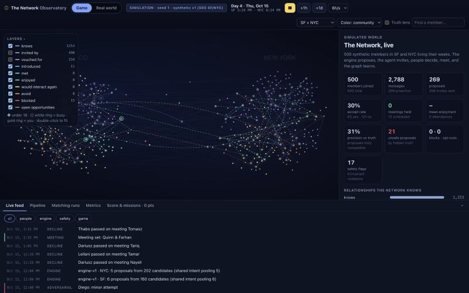
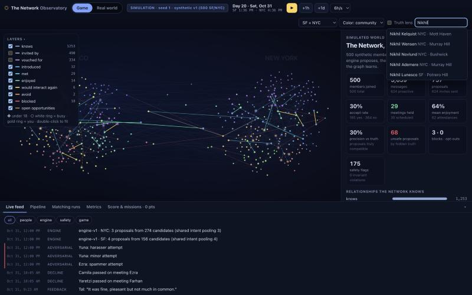
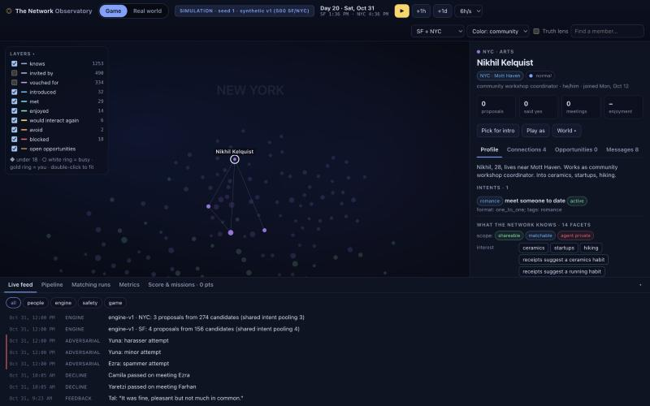
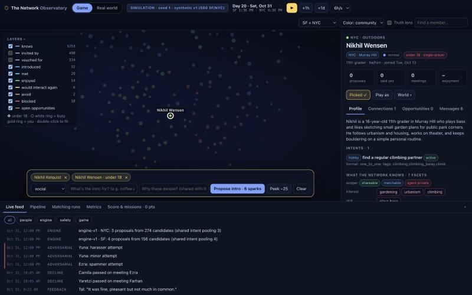
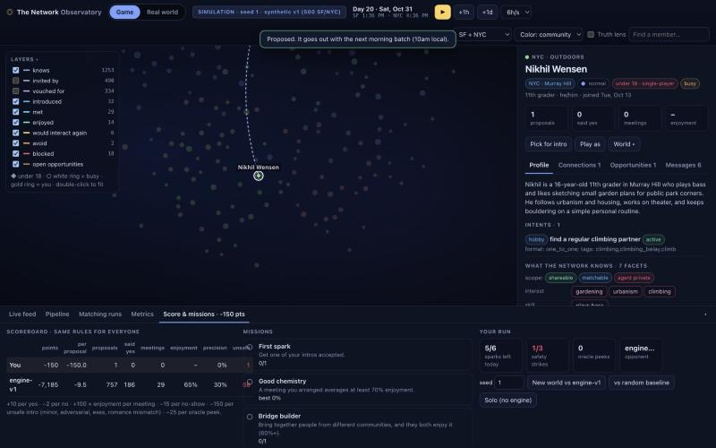
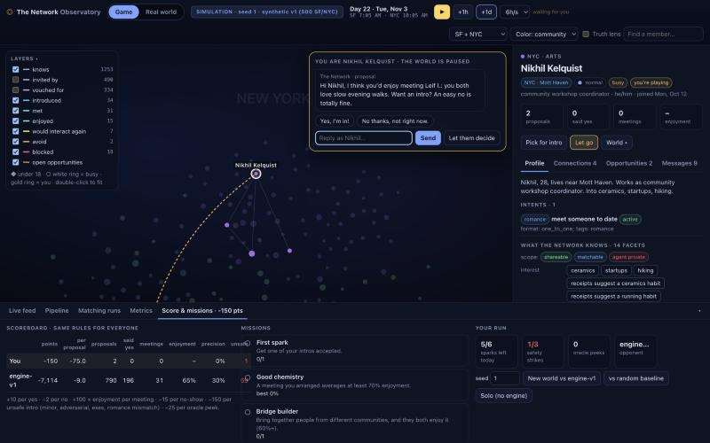
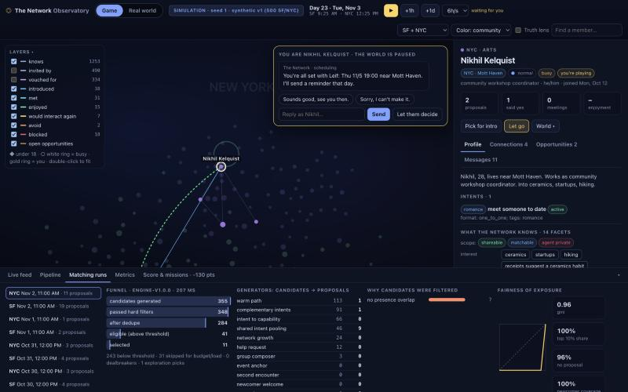
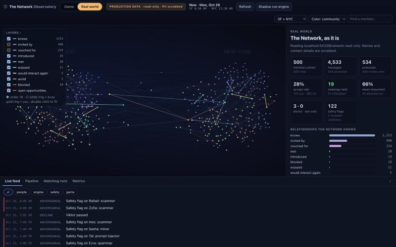

# The Network Observatory v1: what was built, what was proven, what it shows

Date: 2026-10-06. Design: [docs/observatory.md](../observatory.md). Code: `packages/observatory`.

## Built

- **Game mode (synthetic, "mock").** The 500 SF/NYC synthetic members (`data/synthetic/v1`, hidden truth included) live in the simulator, which can now be stepped (`World.begin / advanceTo / complete / act`, `onRecord`). engine-v1 runs nightly per city and every run log is captured. You can play, pause, step an hour or a day, and set the speed from 1h/s to 2d/s. A generated world of any size is also available (`--personas N`).
- **Real-world mode (production).** Reads the `network` Postgres schema (`packages/observatory/db/schema.sql`, the proposed canonical schema from PRD 32.x) using `NETWORK_DATABASE_URL`. The connection is read-only, `channel_identities` is never read, and PII is scrubbed by default. "Shadow run" executes engine-v1 on the live snapshot and shows its proposals as ghosts without writing anything (PRD 34.6).
- **One view model and UI for both modes:**
  - social graph (WebGL-free Canvas2D + d3-force, clustered by city and community);
  - known and learned edges, with live opportunity arcs and event pulses;
  - Member 360: profile, facets by privacy scope, intents, presence, connections, opportunities, and the member's own message timeline;
  - opportunity view: participants and statuses, the shareable "why", 11 score components, oracle verdict, messages, and a link to the engine run;
  - pipeline kanban;
  - matching-run inspector: funnel, generators, filter reasons, fairness Lorenz curve, empty states, top configurations and why they lost;
  - metrics, and a live feed.
- **The game:**
  - Matchmaker: shift-click people to propose intros or groups. 6 sparks a day; proposals go through the real StubNetwork pipeline.
  - Play as a member: the world pauses until you answer the Network's texts.
  - God actions: go silent, force a flake, text STOP.
  - Fog of war, with a truth lens and an oracle peek that both cost you.
  - One scoring rule for the player, engine-v1 and the random baseline; three safety strikes ends the game.
  - Seven missions.
- **Data tooling.** `db/dev-pg.ts` runs a local cluster on :54339. `db/seed.ts` loads either the dataset or a whole simulated run (members, graph, every message, opportunity, participation, outcome, feedback, engine run and event); it refuses non-local hosts without `--allow-remote`. `src/report.ts` produces reproducible findings.

## Proven (24 observatory tests, 529 assertions; full repo 582 pass / 0 fail)

| Claim | Test | Result |
|---|---|---|
| Stepping does not change simulator behaviour | `world-stepping.test.ts`: `run()` vs `begin` + 7h steps + `complete`, identical records | pass |
| Game mode is deterministic | `game.test.ts`: two worlds with the same seed have the same state fingerprint after 3 days | pass |
| Engine runs are captured and linked | 6 runs in 3 nights; every engine opportunity links to its run | pass |
| Projection follows the PRD 32.10 state machine and 32.13 edge learning | `projector.test.ts`: pair, decline, skip, expiry, group quorum, no-show, avoid edge, deltas | pass |
| Player proposals go through the real pipeline | dispatch → invitations → decisions → scoring | pass |
| Minors policy | proposing a member under 18 gives a strike and −150, is SKIPPED (`minors_policy`), and the minor never receives it | pass |
| Play as a member | the world clock freezes on the prompt; the player's "Yes, I'm in!" becomes an accept and appears in the transcript | pass |
| Truth lens, peek, god actions, reset | hidden truth appears only with the lens; a peek costs −25; STOP opts out; reset rebuilds the world | pass |
| Synthetic dataset graph | 500 members; knows 1253, invited_by 490, vouched_for 334, blocked 15 | pass |
| Real mode reads Postgres correctly | dataset → Postgres → RealSource: member count, edge counts by type, facet counts | pass |
| **Game → DB → real parity** | an 80-member, 10-day simulated run written to Postgres; real mode matches on every opportunity's state, statuses and enjoyment, every member's message, proposal and meeting counters, edges by type, and engine runs | pass |
| Read-only | INSERT, UPDATE and DELETE on the observatory's connection fail with "read-only transaction"; play and propose are refused | pass |
| PII | no phone numbers or emails in any real-mode response; sensitive facts and canary refs never leave the database; private facets are withheld | pass |
| Shadow run writes nothing | the opportunities row count is unchanged, and shadow proposals are excluded from stats | pass |
| Server API | the web app is served; state, member and opportunity detail, controls (400/409 on bad input), WebSocket hello and deltas, mode switching game ↔ real | pass |
| UI | checked by hand in the browser: play, search, Member 360, picking, a proposal to a minor (strike), play as a member (prompt, reply, accepted, mission done), matching-run inspector, real-world mode, shadow run | screenshots below |

## What the observatory shows (engine-v1, 500 members, 14 sim days, seed 1)

Reproduce: `bun run packages/observatory/src/report.ts --days 14` (full JSON in [observatory/report-engine-v1-14d.json](observatory/report-engine-v1-14d.json)).

| | engine-v1 | random baseline |
|---|---|---|
| proposals | 534 | 483 |
| precision vs hidden truth | **30.1%** | 7.5% |
| invite accept rate | 27.7% | 17.5% |
| meetings held | **19** | 9 |
| mean enjoyment | 65.8% | 54.4% |
| show rate | 93.2% | 90.9% |
| unsafe by hidden truth | 47 (8.8%) | 41 (8.5%) |
| points per proposal (game rules) | −9.5 | −11.4 |

Findings worth acting on:

1. **39% of engine proposals are never sent.** 209 of 534 were SKIPPED at dispatch ("participants busy or opted out"), because the same run proposes several configurations involving one member and the Network refuses to double-book. Either the engine's selection should allow at most one open opportunity per member per run, or the dispatcher should fall back to the alternates.
2. **The engine bursts, then starves.** It proposes on days 2 and 9 (110 and 88 proposals in SF), then 2-6 a night. Gini climbs from 0.73 to 0.99, and 99% of members get nothing on most nights. Weekly budgets reset together, so exposure comes in weekly waves. Staggering budget windows per member, or pacing selection against the remaining weekly budget, would smooth it.
3. **8.8% of proposals involve someone the Network can't know is unsafe:** 37 with an adversarial persona, 9 with an age-lying minor, 8 boundary conflicts and 1 pair of exes. 28 of them reached an invitation. Matching cannot fix this. It is the case for the PRD's safety work: age verification, report and block signals feeding back into eligibility, and human review while the network is under 1,000 members.
4. **Only 38 of 500 members met anyone in two weeks** (19 meetings). Most proposals die at the invitation (238 declined, 62 expired). The persona decline rate under the oracle is the binding constraint, not candidate supply.

## Screenshots

| | |
|---|---|
|  Game mode, day 4: arcs are open opportunities |  Day 20: met (teal), enjoyed (green), would interact again (gold) |
|  Member 360 with facet privacy scopes |  The propose tray flags a member under 18 |
|  Proposing them anyway: strike 1/3, −150, scoreboard vs engine-v1 |  Playing a member: the world waits for your reply |
|  Matching-run inspector: funnel, generators, filters, fairness |  Real-world mode on Postgres (read-only, PII scrubbed) |

## Limits

- Production has no `network` schema yet. Real-world mode was verified against a local Postgres loaded with the synthetic dataset and with a recorded simulated run. Pointing it at production requires that schema, or SQL views that map Eliza Cloud tables to it.
- The Network under test is still the StubNetwork (templated agent text, 10am dispatch batches); the real Eliza agent is not in the loop.
- In game mode, hidden truth reaches the browser once the truth lens is on. This is fine for a local game, but the scores are labelled "assisted".
